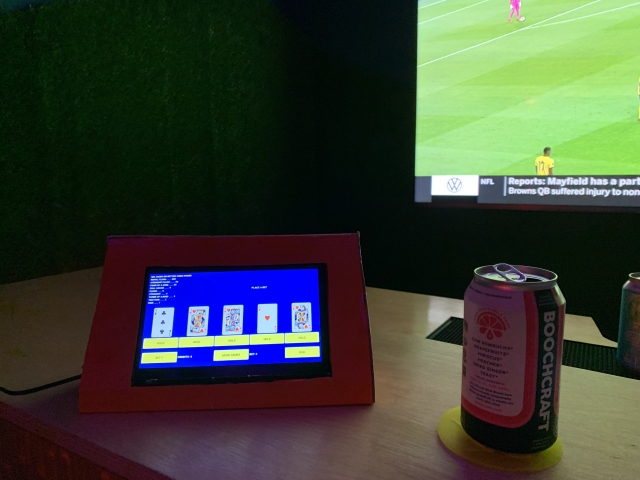
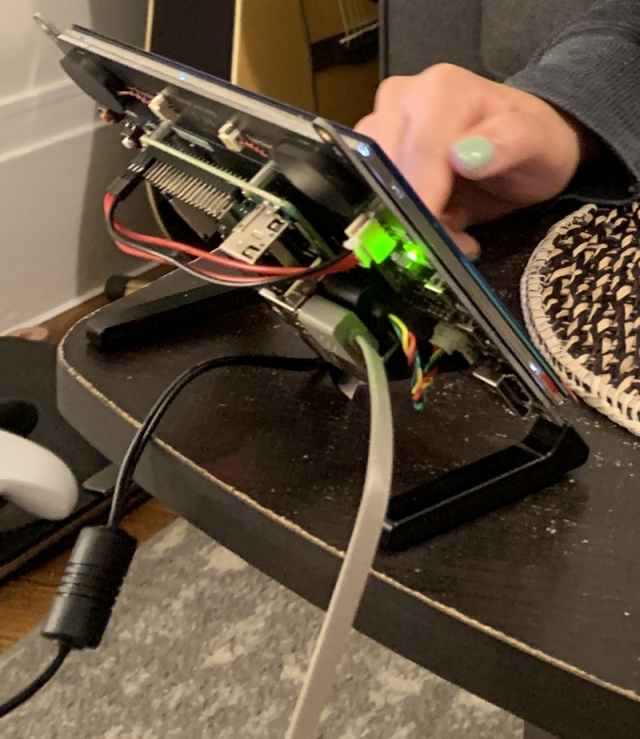

# Casino

Casino is a python3 PyQT desktop application designed to simulate a video poker machine. It was designed to be deployed on a touch screen + Raspberry Pi. It uses the [NIST randomness beacon](https://csrc.nist.gov/projects/interoperable-randomness-beacons/beacon-20) when shuffling the cards.

This was made as part of my Halloween costume for party in October 2021. I went as a fully-interactive casino card dealer. While I was busy at the party, I could leave this machine in a corner to entertain more guests. To be honest, I spent more time on building this machine and this application than I did on the clothes of my actual costume.

It plays Video Poker quite well. I had hopes to implement video blackjack, but I couldn't get the graphical component to work in time for the party.

To use:
- install python 3.8 using pyenv
- install pipenv
- install dependencies: `pipenv install -d`
- run the GUI application: `pipenv run python casino/gui.py`

**Warning**: This is nasty hackathon code and my first PyQT application, so it will be a mess. 
